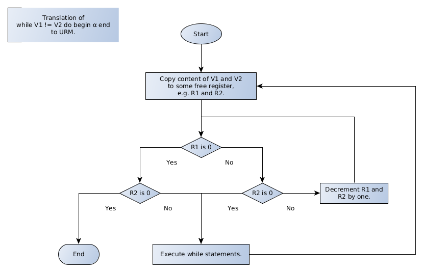

# TI-Praktikum

## Praktikum 1

[Aufgabenstellung](p1/Aufgabenstellung.pdf)

Ziel des ersten Praktikumversuches ist die Entwicklung eines Parsers für WHILE0-Programme mittels JavaCC.

Wie in Übungsaufgabe 13 sind WHILE0-Programme WHILE-Programme (Definition siehe Skript), in denen Wertzuweisungen auf solche der Form `V1 = V2 + 1` und `V1 = 0` beschränkt sind und weitere Anweisungen nur durch Sequenz `α1; α2` und Wiederholungsanweisungen der Form `while V1 != V2 do begin α end` konstruiert sind.

### Aufgabe 1
Geben Sie zunächst ein Syntaxdiagramm zur Beschreibung der Syntax von WHILE0-Programmen an.

Lösung:
* [while0parser.ebnf](p1/diagram/while0parser.ebnf)
* [while0parser.xhtml](https://cdn.rawgit.com/albertkasdorf/TI-Praktikum/170038b9/p1/diagram/while0parser.xhtml)

Erstellen Sie eine .JJ-Datei, die den Scanner (Tokendefinition als Reguläre Ausdrücke) und Parser (Typ 2-Grammatik in javaCC-Notation) enthält.

* Eine Dokumentation zu JavaCC finden Sie z.B. hier: https://javacc.org/doc
* In der .JJ-Datei definieren Sie die Syntax der While0-Sprache mittels EBNF-ähnlichen Regeln, die Regeln können mit beliebigem Java-Code erweitert werden.
* Definieren Sie zuerst sinnvolle Token als reguläre Ausdrücke zur Beschreibung der lexikalischen Konstrukte, z.B. NUMBER, IDENT usw.
* Anschließend erstellen Sie die Regeln für die Syntax der WHILE0-Sprache. In JavaCC werden Regeln als Methoden implementiert (in diesem Versuch ist es noch nicht zwingend notwendig die Regeln mit Java-Code zu erweitern).
* Im letzten Schritt muss in der .JJ-Datei ein Hauptprogramm geschrieben werden, das ein WHILE0-Programm einliest und dazu eine Ausgabe liefert im ersten Praktikum soll die Ausgabe nur beinhalten, ob das eingegebene Programm.
* Ein gültiges While0-Programm ist (JA/NEIN). Im zweiten Praktikum liefert die Ausgabe dann den in URM übersetzten Quellcode.

Lösung:
* [while0parser.jj](p1/while0parser/src/while0parser.jj)

### Aufgabe 2
Überlegen Sie sich, wie Sie den WHILE0-Befehl `while V1 != V2 do begin α end` in gültige URM-Befehle übersetzen können.

Lösung:
* [a2_while_to_urm.graphml](p1/diagram/a2_while_to_urm.graphml)

## Praktikum 2
